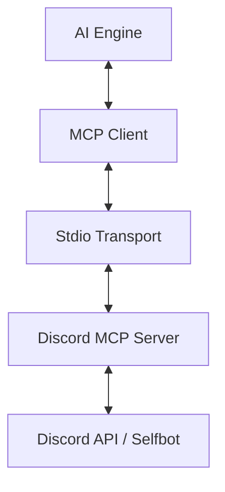

# Discord MCP Server

A robust Model Context Protocol (MCP) server that integrates Discord with AI environments, enabling data extraction, channel monitoring, and automated insight generation.

> [!CAUTION]
> **Compliance & Security**: This project utilizes `discord.js-selfbot-v13`. Automating user accounts (Selfbots) violates Discord's Terms of Service and may lead to a permanent account ban. Use this software responsibly and preferably with test accounts.

## Technology Stack

- **Language**: TypeScript
- **Runtime**: Node.js
- **Protocol**: [Model Context Protocol (MCP)](https://modelcontextprotocol.io/)
- **Core Library**: `discord.js-selfbot-v13`
- **Validation**: `Zod`

## Architecture



The server communicates via JSON-RPC over `stdio`, allowing Large Language Models (LLMs) to invoke tools and interact with the Discord ecosystem in real-time.

## Available Tools

### `list_guilds`

Lists all servers where the authenticated account is a member.

- **Inputs**: None.

### `list_channels`

Lists all text channels within a specific server.

- **Arguments**:
  - `guildId` (string): Unique Discord server ID.

### `read_messages`

Retrieves recent message history from a channel.

- **Arguments**:
  - `channelId` (string): Channel ID.
  - `limit` (number, default: 50): Number of messages to fetch (max 100).

### `search_messages`

Performs refined message searches using multiple filters.

- **Arguments**:
  - `channelId` (string): Channel ID.
  - `query` (string, optional): Search term.
  - `authorId` (string, optional): Filter by author ID.
  - `before`/`after` (string, optional): Message IDs for temporal pagination.
  - `limit` (number, default: 50).

### `deep_search`

Performs a deep search on a specific topic within a Discord server/guild to extract information, links, and ideas. This tool retrieves a larger volume of messages than standard search by paginating through results.

- **Arguments**:
  - `guildId` (string): Unique Discord server/guild ID.
  - `query` (string): The search query/topic.
  - `limit` (number, default: 100, max: 500): Max number of messages to retrieve.

### `generate_report`

Analyzes channel context and prepares a structured report for AI consumption.

- **Arguments**:
  - `channelId` (string): Channel ID.
  - `topic` (string): Central topic for analysis.
  - `limit` (number, default: 50).

## Configuration and Installation

### Prerequisites

- Node.js v18+
- NPM or Yarn

### 1. Installation

```bash
npm install
npm run build
```

### 2. Environment Variables

Create a `.env` file in the root directory:

```env
DISCORD_TOKEN="your_user_token_here"
```

### 3. MCP Client Integration

Add the following configuration to your MCP client's `settings.json` (e.g., Claude Desktop):

```json
{
  "mcpServers": {
    "discord": {
      "command": "node",
      "args": ["/path/to/your/project/dist/index.js"],
      "env": {
        "DISCORD_TOKEN": "your_token_here"
      }
    }
  }
}
```

## How to Obtain Your Token

1. Access Discord via a web browser and log in.
2. Open **Developer Tools** (F12 or `Ctrl+Shift+I`).
3. Navigate to the **Application** tab and select **Local Storage**.
4. Select `discord.com` and filter by `token`.
5. Refresh the page and copy the token value.

## License

Distributed under the MIT License. See `LICENSE` for further details.
